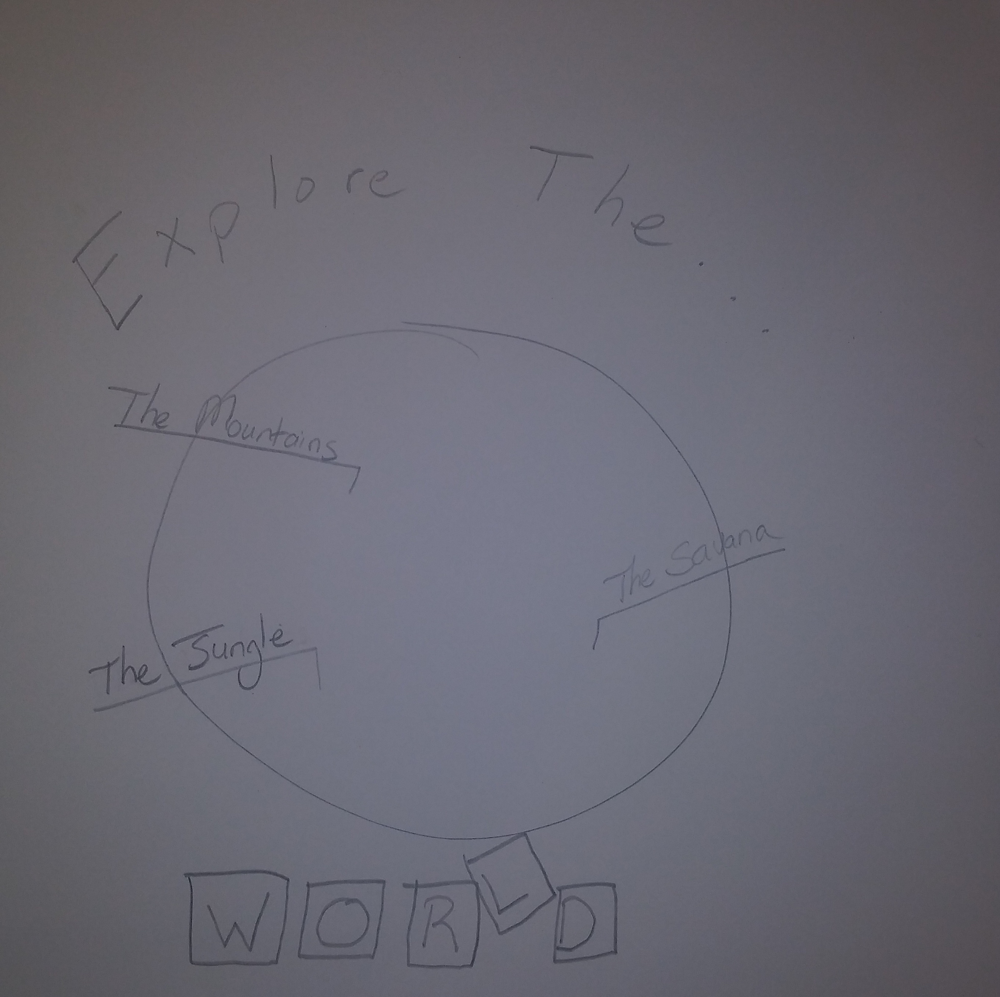
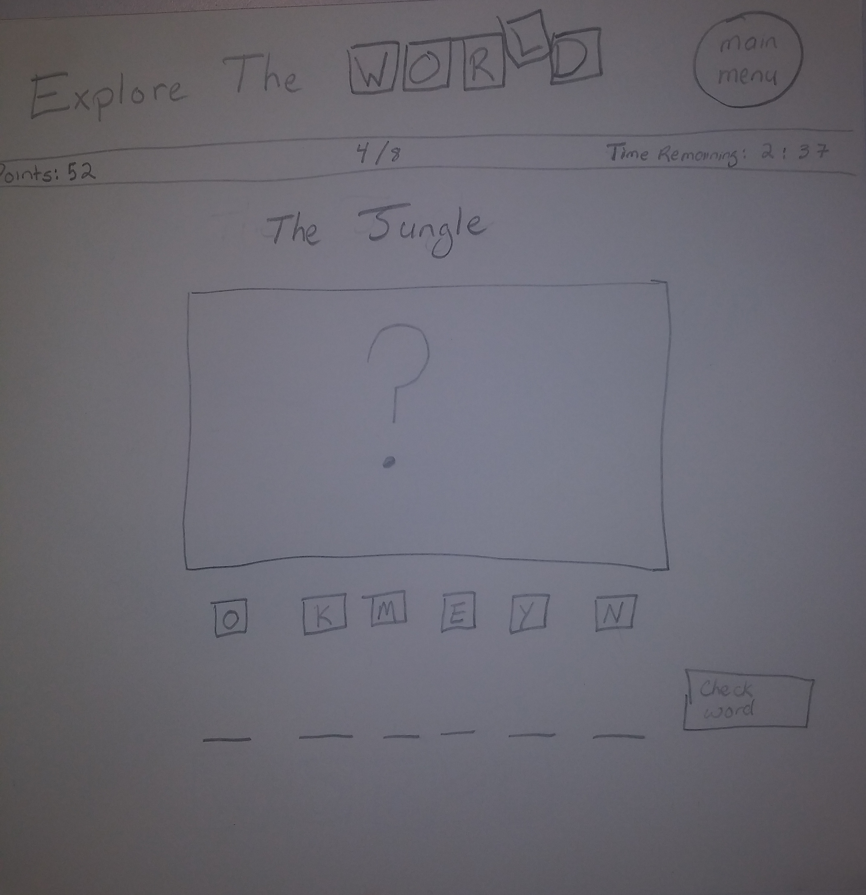
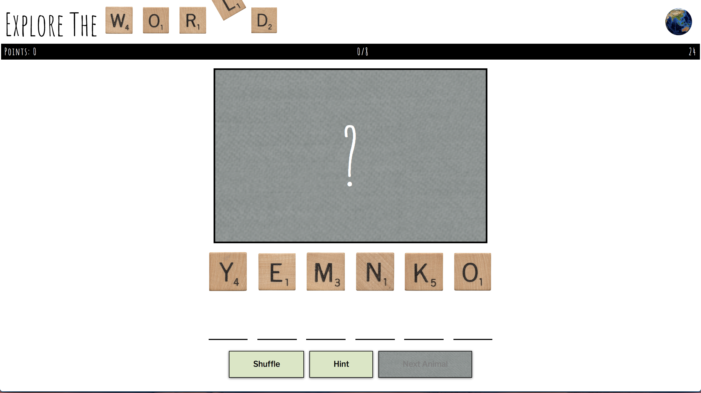
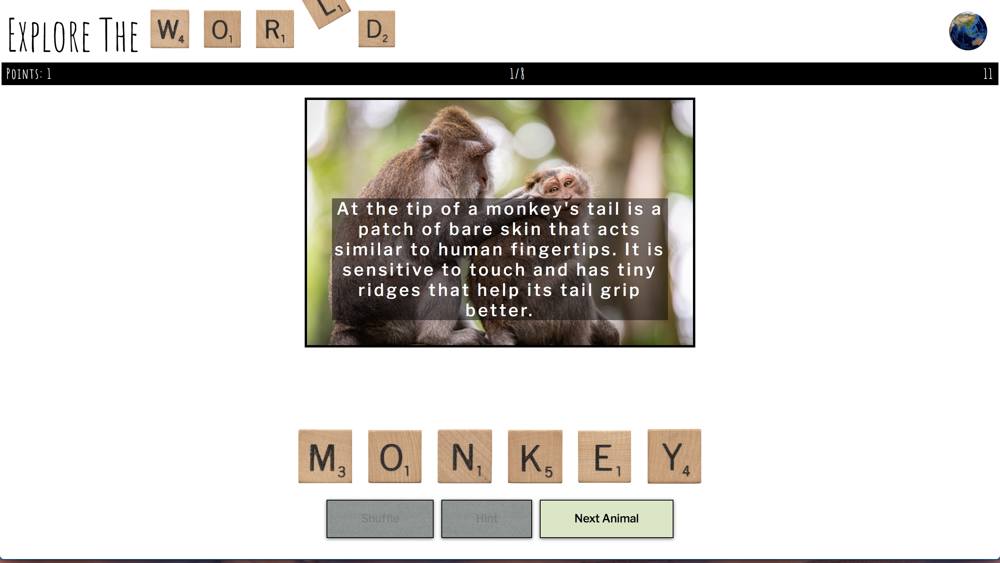

# [Explore the World](https://linnaek.github.io/ExploreTheWorld/)

Select your region of choice and face animals like you have never seen before. You will be provided with the letters for each animal, but they will be all scrambled up. It will be your job to figure out the correct order of the letters. Once the letters are ordered you will be provided with a picture of the animal along with an interesting fact regarding them. But hurry, you have to solve each of the eight animals in a region before the timer runs out or else you will have to start all over again! 

## User Stories

### As a user I can ...
* select one of three regions
* drag and drop scrambled letters into their correct order
* see the time remaining for me to complete my current region
* verify if I have put letters in the correct order
* see a photo and interesting fact regarding the animal once I have put letters in the correct order
* see how many animals I have solved out of the entire region
* accrue points by how fast I put letters in the correct order
* loose points by submitting an incorrect word
* select a button to reorder the letters
* ask for a hint and have one letter put in the correct place
* be congratulated when I have completed a region and see the number of points I acrued and how fast I completed it

### Home Page - wireframe 
#### User can select region in which to play

### Playing Page - wireframe
#### User unscrambles letter in order to see picture and information regarding the animal

### Beginning play view

### Word Completion

### Technology Used

* HTML
* CSS
* JavaScript

## Next Steps
* Mobile Friendly
* Random order of animals for each scene
* Notice when user makes an incorrect play for each letter (instead of each word)